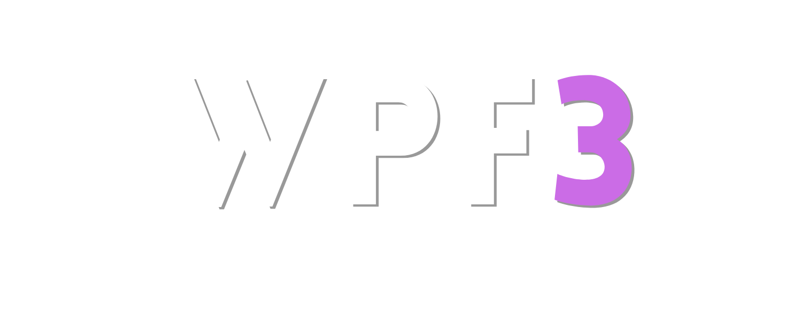

<a - `github/instructions/wpf3-framework.instructions.md`: Documented the `oc(value)` utility with examples, accepted forms (hex, rgb, rgba, token), the "no spaces" rule in rgb/rgba and usage notes;ref="https://webeponto.com.br" target="_blank"><a>

# WPF 3.0
## Developed by Lyautey M. Neto, Matheus Patrignani e David Henderson

[See Change History](https://github.com/webeponto/wpf-sass/commits).

**Changelog**

## 3.0.3 - Alpha
- `sass/wpf/mods/_buttons.scss`: **🚀 REVOLUTIONARY WPF3 DYNAMIC BUTTON SYSTEM** - Created a completely new, modern button component architecture that establishes WPF3 as a next-generation CSS framework. Introduced the `.wpf3-btn` foundation class featuring CSS custom properties for theme-aware dynamic styling, advanced accessibility with focus-visible support, and micro-interaction animations with hover/active state management;
- `sass/wpf/mods/_buttons.scss`: **🎨 SEAMLESS WPF3 VARIABLE INTEGRATION** - Completely integrated button system with existing WPF3 variable architecture from `_default.scss` and `_dark.scss`. All button variants now use authentic WPF3 colors: primary theme (`--c-t1-400`, `--c-t1-500`), semantic indicators (`--c-success`, `--c-alert`, `--c-error`, `--c-notification`), text colors (`--c-s-1`, `--c-s-5`), backgrounds (`--c-bg-1`, `--c-bg-3`), borders (`--c-border-1`, `--c-border-2`), typography (`--fnt-1`), transitions (`--t-fast`, `--t-normal`), and effects (`--fx-shadow-1`);
- `sass/wpf/mods/_buttons.scss`: **Advanced Component Variant System** - Developed 8 semantic color variants (primary, secondary, success, warning, danger, dark, light, notification) with automatic WPF3 theme integration, 3 style variants (outline, ghost, gradient) using WPF3 gradient variables, and 4 size variants (xs, sm, lg, xl) with scalable CSS custom properties;
- `sass/wpf/mods/_buttons.scss`: **Professional Animation System with WPF3 Timing** - Implemented 6 advanced animation effects: ripple effect with WPF3 transition timing, shimmer effect using WPF3 animation duration, magnetic effect with WPF3 fast transitions, loading state with WPF3 disabled colors, glow effect using WPF3 primary colors, and pulse animation with WPF3 theme color integration;
- `sass/wpf/mods/_buttons.scss`: **Intelligent Dark Mode Integration** - Built automatic dark mode support using `prefers-color-scheme` with WPF3 dark theme variables, enhanced contrast adjustments for accessibility, and special `.wpf3-theme` class for complete WPF3 variable integration including colors, typography, and timing;
- `sass/wpf/mods/_buttons.scss`: **Component Architecture Excellence** - Created button group system (`.wpf3-btn-group`) with seamless border radius management, split button component (`.wpf3-split-btn`) for dropdown functionality, and intelligent icon integration with proper spacing and flex alignment for both text+icon and icon-only buttons;
- `wpf3-buttons-demo.html`: **WPF3-Integrated Interactive Demonstration** - Updated comprehensive showcase page to use authentic WPF3 variables and colors, demonstrating real-world integration with WPF3 design system. Features live interactive effects using WPF3 color palette, responsive behavior testing, accessibility demonstrations, and authentic WPF3 theming examples;
- `.github/instructions/wpf3-framework.instructions.md`: **Component Development Guidelines** - Added comprehensive section documenting the distinction between utility classes (wpf.config.yaml) vs component classes (SCSS modules), complete WPF3 variable integration rules with all color/typography/effect references, variable location guide pointing to `_default.scss` and `_dark.scss`, and component architecture best practices with CSS custom properties and variant systems;
- `sass/wpf/vendor/_mix.scss`: **🛠️ MASSIVE MIXIN LIBRARY EXPANSION** - Added 12 powerful new mixins for rapid development: `generateGrid()` for responsive grid systems, `flexCenter()` for advanced flexbox layouts, `generateShadow()` with 4 shadow types (soft/medium/hard/glow), `aspectRatio()` with modern and legacy support, `gradientBackground()` for linear/radial/conic gradients, `animateProperty()` for CSS animations, `buttonStyle()` for consistent button creation, `cardStyle()` with hover effects, `scrollbarStyle()` for custom scrollbars, and `textGradient()` for gradient text effects;
- `sass/wpf/vendor/_fun.scss`: **⚙️ COMPREHENSIVE FUNCTION LIBRARY** - Added 15 essential utility functions: `stripUnit()` for removing units, `toEm()` for px-to-em conversion, `calculateContrast()` for automatic color contrast, `lightenSmart()`/`darkenSmart()` for intelligent color manipulation, `getZIndex()` with predefined scale (base/dropdown/sticky/fixed/modal/popover/tooltip/toast), `fluidSize()` for responsive typography, `generateSteps()` for value sequences, `randomColor()` for dynamic colors, `getBreakpoint()` with standard sizes, `clampSize()` for responsive values, and `colorAlpha()` for transparency adjustments;
- `wpf3-mixins-functions-demo.html`: **🎨 INTERACTIVE SHOWCASE DEMONSTRATION** - Created comprehensive demo page showcasing all new mixins and functions with live examples, interactive elements, and practical use cases. Features grid systems, flexbox layouts, shadow variations, aspect ratios, gradient backgrounds, button styles, card components, custom scrollbars, text gradients, and animated examples with click-to-restart functionality;
- `js/wpf/dynamic/wpf.config.yaml`: Enhanced framework with comprehensive CSS variables support through token-based utilities, enabling dynamic styling controlled via JavaScript. Added variable versions for aspect ratio (`ratio-(token)`), transitions (`t-(token)`, `delay-(token)`), transforms including scale (`scale-(token)`, `scale-x-(token)`, `scale-y-(token)`, `scale-z-(token)`, `scale-3d-(token)`), opacity (`opacity-(token)`), rotation (`rotate-(token)`, `rotate-x-(token)`, `rotate-y-(token)`, `rotate-z-(token)`, `rotate-3d-(token)`), translation (`translate-x-(token)`, `translate-y-(token)`, `translate-z-(token)`), and grid utilities (`span-col-(token)`, `span-row-(token)`);
- `js/wpf/dynamic/wpf.config.yaml`: All new variable-based utilities use the syntax `utility-(token)` mapping to `CSS-property: var(--token)`, allowing runtime customization of styling values through CSS custom properties without regenerating utility classes;
- `js/wpf/dynamic/render.js`: **Major refactoring of class extraction system** - Completely redesigned `extractClassGroupsFromFile()` function to support multiple delimiters and complex framework syntaxes. Replaced single regex pattern with sophisticated multi-pattern detection supporting double quotes (`"..."`), single quotes (`'...'`), template literals (\`...\`), and Alpine.js/Vue objects (`{...}`);
- `js/wpf/dynamic/render.js`: Enhanced Blade framework support with specialized detection patterns for conditional expressions (`{{ condition ? 'class-name' : '' }}`) and Blade functions (`@svg('icon', 'class-list')`). Added intelligent class extraction that processes Blade syntax before standard normalization to prevent class loss in complex template structures;
- `js/wpf/dynamic/render.js`: Improved CSS value protection during class extraction - Added safeguards for comma-separated values like `rgba(255,255,255,0.5)` by temporarily protecting parentheses content, preventing CSS color values from being incorrectly split as separate classes during normalization;
- `js/wpf/dynamic/render.js`: Advanced Alpine.js and Vue.js compatibility with enhanced token normalization that removes trailing colons from object property separators while preserving breakpoint prefixes (`sm:`, `md:`, etc.), ensuring accurate class detection in reactive framework contexts;
- `sass/wpf/vendor/_anim.scss`: **Massive animation system expansion** - Added 13 sophisticated animation mixins transforming the framework from basic 6-mixin setup to comprehensive 19-mixin animation library. Introduced movement animations (`wiggle`, `shake-x`, `shake-y`, `float`, `swing`), transformation effects (`tilt`, `jelly`, `flip`, `heartbeat`), interactive hover animations (`hover-glow`, `underline-sweep`, `ripple`, `highlight-sweep`), and visual effects (`shimmer`);
- `sass/wpf/vendor/_anim.scss`: Advanced animation architecture with unique hash system - Each mixin generates collision-free keyframes using `getHash()` function, enabling multiple instances of the same animation type without conflicts. All animations feature comprehensive parameter customization including duration, loop control, scale factors, colors, directions, and trigger selectors;
- `sass/wpf/vendor/_anim.scss`: Professional-grade interactive animations with CSS3 techniques - `hover-glow` creates pulsating box-shadow effects, `ripple` uses pseudo-elements for expanding wave animations, `underline-sweep` implements gradient-based text underlining, `highlight-sweep` provides background text highlighting with directional control, and `shimmer` delivers surface reflection effects using gradient animations;
- `sass/wpf/vendor/_anim.scss`: 3D animation support with `flip` mixin offering X/Y axis rotation with `transform-style: preserve-3d`, `jelly` providing non-uniform scale3d transformations for organic movement effects, and `tilt` delivering perspective-aware rotation animations with customizable transform origins;

## 3.0.2 - Alpha
- `js/wpf/dynamic/wpf.config.yaml`: Added *Flex Wrap* utilities `wrap`, `nowrap`/`no-wrap` and `wrap-reverse`;
- `js/wpf/dynamic/wpf.config.yaml`: Restored compatibility for numerous utility classes that were present in WPF2 but not in WPF3, such as aliases *gap-r* (row-gap) and *gap-c* (column-gap), *row-N* (grid-template-rows), *span-row-N* and auto-flows *flow-row|flow-col|flow-dense|flow-dense-row|flow-dense-col*, in addition to classes that dictate content reading direction, such as helpers *ltr* and *rtl*;
- `js/wpf/dynamic/wpf.config.yaml`: Configured contextual rules for utility classes related to *.dp-grid* with alignments *v-top|v-center|v-bottom|v-stretch|v-baseline* and *h-left|h-center|h-right|h-between|h-stretch*;
- `js/wpf/dynamic/render.js`: Token normalization in languages like *AlpineJS* and *Vue* to remove terminal `:` characters in braces and ensure class detection in these contexts;
- `js/wpf/dynamic/wpf.config.yaml`: New CSS variable-based utilities (dynamic token conjugation in parentheses): `fs-(token)`, `lh-(token)`, `gap-(t)`, `gap-x-(t)`, `gap-y-(t)`, `p-(t)`, `px/py/pt/pr/pb/pl-(t)`, `m-(t)`, `mx/my/mt/mr/mb/ml-(t)`, `w-(t)`, `w-(t)-min/max`, `h-(t)`, `h-(t)-min/max` → mapped to `var(--token)`;
- `views/wpf3-var-test.blade.php`: Monitored test file to validate generation of new variable classes (removable after validation);
- `js/wpf/dynamic/render.js`: Fixed issue that removed `:` in class extraction, failing recognition of breakpoint variants;
- `js/wpf/dynamic/wpf.config.yaml`: In *dp-grid* contexts, adjusted horizontal orientation mapping (`h`) to use `justify-content` (as in WPF2), avoiding inconsistencies in horizontal alignment in `dp-grid`;
- `github/instructions/wpf3-framework.instructions.md`: Documented the new variable-based utilities mode, with `name-(token)` syntax mapping to `var(--token)` and practical examples (fs, lh, gap, padding/margin, width/height);
- `github/instructions/wpf3-autofixer.instructions.md`: Documented new useful instructions for the library to understand when utility classes should be organized under the same configuration (when multiple values belong to the same group);
- `js/wpf/dynamic/wpf.config.yaml`: Developed support for variables/tokens in numerous utility classes such as *offset*, *z-index*, alternative versions (aliases) of *gap-row* and *gap-col*, *border*, *rounded* and *outline*;
- `github/instructions/wpf3-framework.instructions.md`: Documentado o utilitário `oc(valor)` com exemplos, formas aceitas (hex, rgb, rgba, token), a regra de “sem espaços” em rgb/rgba e observações de uso.
- `js/wpf/dynamic/render.js`: Fixed class extraction to preserve commas inside parentheses, preventing truncation of tokens like `rgba(255,255,255,0.5)` during normalization;
- `js/wpf/dynamic/wpf.config.yaml`: Reinforced RGB/RGBA rules to not accept spaces inside parentheses, ensuring consistent detection and generation;
- `js/wpf/dynamic/wpf.config.yaml`: Unified outline border color utility via `oc(value)` with support for literal values and tokens: `oc(#hex)`, `oc(rgb(r,g,b))`, `oc(rgba(r,g,b,a))` (no spaces) and `oc(token)` → `outline-color: var(--token)`;
- `js/wpf/dynamic/wpf.config.yaml`: Separate patterns for each literal form to ensure valid CSS: `outline-color-hex`, `outline-color-rgb`, `outline-color-rgba`, in addition to `outline-color-var`;
- `github/prompts/wpf-convert.prompt.md`: Created a prompt to assist in converting classes from WPF2 to WPF3;
- `js/wpf/dynamic/wpf.config.yaml`: Added 'auto' versions for sizes and spacing: `w-auto`, `h-auto`, `m-auto`, `mx-auto`, `my-auto`, `mt-auto`, `mr-auto`, `mb-auto`, `ml-auto`;
- Introduced two new intelligent assistant commands exclusively designed to help users utilize GitHub Copilot (or any other intelligent AI Agent) for enhanced WPF3 development experience;
	- **`/wpf3-find` Command**: AI command followed by a question, CSS attribute, or class name that provides detailed information about its concept and availability in the WPF3 infrastructure. Examples: `/wpf3-find border`, `/wpf3-find gap utilities`, `/wpf3-find flexbox alignment`;
	- **`/wpf3-convert` Command**: AI command that studies class patterns from one or more attached pages/files, searching for legacy CSS styles and converting them to their respective WPF3-compatible variations. Automatically detects WPF1/WPF2 patterns and suggests modern WPF3 equivalents;

## 3.0.1 - Alpha
- `.github/instructions/wpf3-framework.instructions.md`: Added a new file with instructions for the GitHub Copilot tool to help developers use WPF3 more effectively. The file includes tips on how to use the tool to generate code, understand WPF3's features, and improve productivity while working with the framework. It contains all the necessary information for the AI to assist and to know how to access and use every utility class, class function, mixin, and feature available in WPF3, immediately improving the developer's experience and productivity and responding to every question about the framework;
- `.github/instructions/wpf3-autofixer.instructions.md`: Added a new file with instructions for the WPF3 *Autofixer* tool, which helps the AI to automatically fix common issues and errors in their WPF3 code. Not only that, but it can also learn from bugs within the library and automatically apply fixes to the core engine behind WPF3's logic, ensuring that the framework evolves and improves with each update, but also help fixing problems that still doesn't have an official solution deployed at the moment;
- `.github/instructions/wpf3-bugs.instructions.md`: Added a new file that helps the AI to track, report and document known issues that the user might be experience while using WPF3. This file is automatically updated every time the user reports an error to the AI Agent of his preference (like GitHub Copilot). Once reported, the AI will try its best to study the issue and use its knowledge learned from our *Autofixer* cheatsheet to look for a fix for the problem, and if it can't find a solution, it will describe the issue the best way it can so the user can manually report it to the WPF3 team at our official page on GitHub;
- `js/wpf/dynamic/render.js`: Included a new method function called *resetConfigAndCache()* to help AI Agents to immediately reset the WPF3 reference guide `wpf.config.yaml` file while the project is running, ensuring the diagnosis tool functions properly while the tool is debugging possible issues in the code;
- `js/wpf/dynamic/render.js`: Improved the *generateContextualCSS()* method to ensure that the WPF3 can properly acknowledge which utility classes are related to contextual patterns or simple patterns, deciding where to apply the styles and how to interpret each class denomination in the final spreadsheet generated by the WPF3 tool;
- `js/wpf/dynamic/render.js`: Removed a lot of unnecessary debugging console logs that were present in the code, focusing on displaying only the extremely necessary information to the user while the tool is running;
- `js/wpf/dynamic/render.js`: Applied more filters and pattern validations to ensure that the *extractClassGroupsFromFile()* method can properly identify and extract all the utility classes present in the files being read by WPF3, fixing a lot of problems where the tool couldn't recognize classes being added through AlpineJS commands or other super-specific cases. This update will remediate a lot of these issues;
- `js/wpf/dynamic/wpf.config.yaml`: Removed duplicated styles for *line-height* and *font-size* options that were present in the reference file;
- `js/wpf/dynamic/wpf.config.yaml`: Re-Added the utility classes *mobile*, *hidden* and *desktop*, now working in the WPF3 environment;
- `js/wpf/dynamic/wpf.config.yaml`: Reviewed and improved the *gap* utility classes to ensure they work seamlessly across different contexts and layouts;
- `js/wpf/dynamic/wpf.config.yaml`: Included a *box-sizing: border-box* style to the utility class *.dp-flex*, just like it was in WPF2;
- `js/wpf/dynamic/wpf.config.yaml`: Added new utility classes for column and span columns configuration for elements that contains a grid display, allowing users to easily define how many columns an element should span across in a grid layout - now also working directly on the WPF3 eccosystem;
- `js/wpf/dynamic/wpf.config.yaml`: Fixed an error with the *.dp-flex* contextual subclasses associated with it that weren't working properly;

## 3.0.0 - Alpha
- Completely reworked the entire WPF tool from scratch, rebuilt from the ground up with a new logic library dedicated to providing much more efficient optimization;
- `js/wpf/dynamic/render.js`: Developed a class interpreter to remove from SCSS the responsibility of manually creating the final results of each possible class in the framework. Programmed to identify regular expressions in YAML, the tool can understand what the user wants to insert based on fundamental rules and logic for each class, making any option possible from that point on;
- `js/wpf/dynamic/wpf.config.yaml`: Most of the SCSS rules present in WPF2, which involved logic and repetitions, have been replaced by regular expressions that shape a consistent and unique logic for each class, read by the *interpreter*. There are no more repetition flows in WPF3, ensuring efficiency and rendering speed like never before;
- `js/wpf/dynamic/wpf.config.yaml`: The old method for generating responsive options like the *mob:* prefix in WPF2 has been replaced by a customizable array of options that, by default, now provides 5 different breakpoint options *(sm/md/lg/mob/xl)*. The *mob:* option is still present, as it represents the maximum value for a tablet screen and the main breakpoint division, but new options are offered and you can even add your own breakpoints by editing the file directly!
- `js/wpf/dynamic/wpf.config.yaml`: The framework configuration file also offers an option called *directoriesToWatch*, which is simply an array of folders and files for the user to configure which directories WPF3 is allowed to access and read for interpretation, giving the developer greater control and customization;
- `js/wpf/dynamic/wpf.config.yaml`: The *outputSCSS* option also provides an easy way to customize the name and location of the final SCSS file generated after WPF3 renders all the interpreted content from your files, into a single CSS stylesheet for your project!
- `js/wpf/dynamic/render.js`: The *'!'* directive to apply the *!important* condition in CSS styles, or the prefixes to signal responsive contexts, are now available in absolutely ALL styles! That's right. No more worrying about whether that specific utility class supported the feature you needed!
- `js/wpf/dynamic/wpf.config.yaml`: All classes that use *percentage* as a unit have undergone a native change in functionality with WPF3 and now *require* the percentage symbol '%' to be specified within the utility class (e.g., w-100 becomes w-100%);
- `js/wpf/dynamic/wpf.config.yaml`: The utility classes for transition timing, previously named *'ease-(value)'*, are now named *'timing-(value)'* (e.g., 'ease-ease-in' becomes 'timing-ease-in');
- `js/wpf/dynamic/wpf.config.yaml`: All classes that supported the *-neg* suffix for negative values have undergone a native behavior change in WPF3. The old method is officially deprecated and will not work from WPF3 onwards. To use negative values in a class, just write them normally, ignoring the first separating dash when it exists (e.g., p-30px-neg becomes p--30px);
- `js/wpf/dynamic/wpf.config.yaml`: The *scale* utility classes now have four additional variations: *scale-x* and *scale-y*, and for 3D manipulation, *scale-z* and *scale* with multiple arguments (e.g., scale-1.2-0.9-1.1);
- `js/wpf/dynamic/wpf.config.yaml`: The *rotate* utility classes now have five additional variations: *rotate-x*, *rotate-y*, *rotate-z*, and *rotate3d* for 3D perspective controls, as well as practical utilities like *rotate-left, rotate-right, rotate-inverted,* and *rotated-upside* for quick shortcuts in many situations;
- `js/wpf/dynamic/wpf.config.yaml`: The *"t"* transition utility classes now also support numeric values in seconds and milliseconds. Just insert them after the dash (e.g., t-400ms or t-3s);
- `js/wpf/dynamic/wpf.config.yaml`: The aspect ratio utility classes now support any type of value, whether *fractional* (e.g., ratio-9/4), *integer decimal* (e.g., ratio-2), or *keyword* (e.g., ratio-video ~ which is the same as ratio-16/9);
- `js/wpf/dynamic/wpf.config.yaml`: The *outline-color* property now has its own utility class function *oc()*;
- `js/wpf/dynamic/wpf.config.yaml`: The *outline-offset* property also has its own utility class *.oo*;
- `js/wpf/dynamic/wpf.config.yaml`: The utility classes related to borders now respond more intelligently: inserting the border style along with the class name creates the complete configuration, while specifying only the size will apply the *border-width* attribute (e.g., b-1px-solid or b-1px will create different behaviors in the final CSS);
- `js/wpf/dynamic/wpf.config.yaml`: Introduced a new system for configuring complex helper classes called *Contextual Patterns* - where you can define regular expressions and rules for class recognition and application based on parent or sibling classes present on the element. This makes it easy to monitor and configure a single property to have multiple uses and adapt based on the context of classes the user typed. (E.g., gap-c can be *column-gap* or *grid-column-gap* based on its display; just gap can refer to *gap* or *border-spacing* based on the display);
- `scss/wpf/vendor/dynamic/wpf-classes-debug.txt`: With this new utility class rendering system, you can now control which classes were detected by our framework in a file that lists all valid utility classes available in WPF3;
- `scss/wpf/vendor/dynamic/wpf-status.txt`: There is also a new file that prints the current status of the renderer, informing whether the tool is working as expected and which resources are being mapped by the library;

## 2.5.1
- `js/wpf/painter.ts`: Updated the *Painter* plugin so that hexadecimal values can be recognized and rendered in real time during the execution of a site already in production, even when values are received dynamically;
- `sass/vendor/wpf.scss`: Added the .list utility classes to define list behaviors such as list-style-type and list-style-position;
- `sass/vendor/wpf.scss`: In the text utility class .t, suffixes were also added to declare all types of text-decoration as independent classes;

## 2.5.0
- `sass/vendor/wpf.scss`: It is now possible to apply the *!important* directive to text clipping classes using the *'!'* before the class. Additionally, this is now usable in responsive contexts with the *mob:* directive;
- `sass/vendor/wpf.scss`: A new set of utility classes focused on word wrapping configuration has been added. The *'w-wrap'* and *'w-nowrap'* classes control the CSS *word-wrap* attribute;
- `sass/vendor/wpf.scss`: New classes have also been added to configure word breaking behavior. The *'w-break'* and *'w-nobreak'* classes control the *word-break* attribute. You can configure more precisely with specific instructions like *'w-break-all'* or *'w-break-keep-all'*, etc.;
- `sass/vendor/wpf.scss`: You can now define which elements can be selected by the user through new utility classes like *'select'*. This can be customized with instructions such as *'select-none'*, *'select-all'*, or *'select-text'*;
- `sass/vendor/wpf.scss`: Fixed a bug where the syntax for applying the *!important* directive to padding or margin classes, when the *mob:* directive was already applied, was incorrect and not following the standard;
- `sass/vendor/wpf.scss`: The pixel limit for width and height denominations using the *'w'* or *'h'* classes has been doubled. The limit was 300 and is now 600 pixels;
- `sass/vendor/wpf.scss`: In addition to the limit change, it is now also possible to specify widths and heights using the value types *'vw'* and *'dvw'* for width and *'vh'* and *'dvh'* for height;
- `sass/vendor/wpf.scss`: For width and height, besides numeric value types, you can now also instruct an element to use *max-content*, *min-content*, and *fit-content* sizes using the utility classes *.w-max, .w-min, or .w-fit* for width or *.h-max, .h-min, or .h-fit* for height;
- `sass/vendor/wpf.scss`: Fixed an error where it was not possible to set height values using the *!important* directive;
- `sass/vendor/wpf.scss`: Changed the property used to configure element rotation to make it more compatible when used with other transform elements;
- `sass/vendor/wpf.scss`: Added the *'pivot'* utility class to set the transform origin of elements;
- `sass/vendor/wpf.scss`: Added the *'flip'* utility class, allowing users to quickly mirror elements horizontally or vertically using the *.flip-h* or *.flip-v* classes;
- `js/wpf/themes.ts`: A new `themes.ts` plugin has been developed for the WPF2 SCSS framework, capable of reading and recognizing different themes and styles present on sites/panels and applying utility classes/instructions/class functions specifically to different styles/themes designated by the programmer using the *theme.themename[classname]* directive. For this change to be applied, an *.themename-theme* class must be active on the html tag. To apply the effect for the default theme (i.e., without a defined theme class), use the *theme.default[classname]* directive;
- `js/wpf/painter.js`: The `painter.ts` plugin has been updated to work in cooperation with the latest WPF2 plugins without issues;

## 2.4.0
- `sass/vars/config.scss`: Fixed an issue where the theme configuration file was set to be rendered to CSS by the SASS framework, which is not necessary for the tool's operation;
- `sass/vendor/vars.scss`: It is now possible to use color-related class functions such as *bg(), bc(), c(), f(), and s()* and assign them the value *transparent* to directly set the transparent color on an element via classes;
- `sass/vendor/vars.scss`: Also in the file responsible for rendering CSS variables and managing class functions, the logic for processing these values has been rewritten to efficiently communicate with the latest versions of SASS and avoid deprecation of features that would no longer be supported in newer framework versions;
- `sass/vendor/wpf.scss`: WPF2 now, by default, can interpolate element sizes designated with units other than pixels, thus avoiding numerous strange or unexpected behaviors when creating animations using responsive and non-exact measurements;
- `sass/vendor/wpf.scss`: The classes *t-wrap* and *t-nowrap* have been added to refer to the CSS value *text-wrap*. Within the *t-wrap* option, it is also possible to specify different types of text wrapping effects such as *.t-wrap-auto, .t-wrap-balance, .t-wrap-stable*, or *.t-wrap-pretty* for various combinations of effects;
- `sass/vendor/wpf.scss`: Added support for the *.!* directive for vertical and horizontal orientation classes of *.dp-flex* and *.dp-inline-flex* positioning, both in the original and responsive scopes;

## 2.3.1
- `sass/vars/config.scss`: The permission variable for displaying (and calculating classes) for the dark theme is disabled by default;
- `sass/vendor/wpf.scss`: Added support for the *!* directive in more framework classes, especially those configuring display types;

## 2.3.0
- `sass/vars/dark.scss` / `sass/vendor/vars.scss` / `sass/vars/config.scss`: WPF2 now officially supports the inclusion of dark themes in project scopes. To configure this feature, you need to edit the `dark.scss` file with the new colors and ensure that the *hasDarkTheme* configuration variable in the `config.scss` file is set to true;
- `sass/vendor/vars.scss`: All class functions now have maximum priority when rendering styles within a site;
- `sass/vendor/wpf.scss`: A new rule has been added, applicable to most utility classes in WPF2, that forces the *!important* behavior on attributes. To add this behavior, simply write *'!'* before the desired class. Although this feature works for most classes, it is still being implemented and future updates will improve this tool as needed;

## 2.2.0
- `js/wpf/lazyload.ts`: Added a helper class ".lazy-load.ignore" that prevents the LazyLoad script from being applied to user-specified elements;
- `js/wpf/pseudos.js`: Integrated the dynamic painting features provided by `js/wpf/painter.js` with the pseudo-classes that make up the *Pseudos* plugin architecture;
- `js/wpf/raw-values.ts`: Temporarily removed the planned plugin for implementing raw values in WPF2 directly in the front-end file from the project scope;
- `sass/vendor/anim.scss`: Added a new rotation animation to the tool's original animation list;
- `sass/vendor/vars.scss`: Removed the forced important hierarchy from some of WPF2's class functions;
- `sass/vendor/wpf.scss`: Among the list of class functions related to absolute positioning, it is now possible to quickly and universally specify the *left*, *right*, *top*, and *bottom* properties using the *inset()* class function;
- `sass/vendor/wpf.scss`: Fixed an error where the *.w* and *.h* helper classes could not accept values of 95% or their variants that increment margins (w95-1, h-95-2, etc.);
- `sass/vendor/wpf.scss`: A solution is being studied to create preventive measures so that color values assigned to borders using WPF2 are not overwritten by other conflicting properties (such as *color* in very specific cases). This solution is a test that changes the logic of how these properties are inserted into the project;
- `sass/vendor/wpf.scss`: Also added a new helper class *bdiv* to automatically add dividing borders to child elements when assigned to the parent element;
- `sass/vendor/wpf.scss`: Another helper class *.o* was also added, which works similarly to the border helper classes but governs the behavior of the *outline* property;
- `sass/vendor/wpf.scss`: In the *.fit* image helper class, the *cover* mode gained new customization options that allow you to specify the image orientation using class suffixes such as *.fit-cover-top*, *.fit-cover-bottom-left*, *.fit-cover-right*, *.fit-cover-bottom-right*, etc.;

## 2.1.1
- `sass/vendor/wpf`: In almost all utility classes that depend on numeric values, it is now possible to set their main property to have a value of zero;
- `sass/vendor/wpf`: In class functions related to absolute positioning, it is now possible to define negative values directly as part of the function's property value;
- `sass/vendor/wpf`: Utility classes related to *border-radius* can now have a different value under the *mob:* directive;
- `sass/vendor/wpf`: Fixed an issue where, depending on the combination of classes related to the *dp-flex* display on an element, the order and type of class combination could limit or completely block the functioning of one or more parts of these classes. This should no longer happen;

## 2.1.0
- We can confidently say that WPF2 is moving out of the alpha development stage into a new phase of final testing to correct the last errors and inconsistencies of version 2.0 of the WPF framework;
- `js/wpf`: A new era of dynamic and highly responsive features has begun for the WPF2 CSS framework, based on TypeScript and JavaScript, capable of quickly reading and manipulating data and introducing a wide range of robust utility classes that will define the future of the tool in upcoming updates. As part of this movement, the debut features are:
	- `Lazyload`: Integrated and responsive, through the utility class *.wpf-lazy-load*, both images and complex elements (divs, forms, sections) can be dynamically loaded and unloaded, only being rendered if they are within the user's device viewport, making the site even more dynamic and responsive, optimizing resource consumption;
	- `Pseudos`: A new WPF2 tool that creates new ways to describe already functional and consolidated WPF2 utility classes. Since the first updates, it was possible to specify a condition like *'mob:'* to instruct the framework to render classes only for responsive scopes. With `Pseudos`, the number of specifications increases from 1 to 5. *('hover:', 'active:', 'focus:', and 'placeholder:')* and all of them work together with the *'mob:'* instruction;
	- `Painter`: The next evolution of truly dynamic classes in WPF2. For the WPF2 v2.1.0 update, we are releasing an update that already allows the use of class functions for coloring *(such as 'bg()', 'bc()', and 'c()')* to work with any pure color in hex format (instead of defining it as 'bg(c-red)', you can simply write it as 'bg(#f00)');
- `sass/vendor/wpf`: Changed the logic for writing utility classes related to *line-height* in WPF2;
- `sass/vendor/wpf`: Developed responsive-compatible versions of utility classes for *text-transform* and *line-height*;
- Updated the official documentation with numerous new features added, as well as existing features from previous updates;

## 2.0.7 - Alpha
- `wpf/vendor/wpf`: Increased the limit for certain value types in the *fs* utility class and added the possibility to use values in 'rem';

## 2.0.6 - Alpha
- `wpf/vendor/wpf`: Added the ability to set text sizes in pixels, percentages, and 'em' units using the *fs* utility class;

## 2.0.5 - Alpha
- `wpf/vendor/wpf`: Added the option to specify the border direction when customizing with utility classes. *br* is border-right, *bl* is border-left, *by* is border-top/border-bottom, and so on;

## 2.0.4 - Alpha
- `wpf/vendor/wpf`: Added the option to configure negative margins, padding, and gaps (within the context of flex display) using the *-neg* suffix at the end of the utility class. It is important to note that negative gaps are not yet fully supported;

## 2.0.3 - Alpha
- `wpf/vendor/vars`: Fixed an error where class functions related to font volume and some class functions related to colors did not properly convert the SCSS variable type to Vanilla CSS, making them unusable in conventional SCSS stylesheets;
- `wpf/vendor/vars`: SCSS transition variables are now also available for use in conventional SCSS stylesheets;
- `wpf/vendor/wpf`: Optimized the way helper classes for positioning are generated, in order to reduce SCSS file size;
- `wpf/vendor/wpf`: Created a version of the *CenterPosition()* mixin as a helper class. If an element contains the class *sticky, relative, absolute, or fixed*, you can add the *center()* function with the parameters "c", "v", or "h" to position them equally, vertically, or horizontally;
- `wpf/vendor/wpf`: Within the *dp-grid* helper class, two subclasses *ltr* and *rtl* have been added to configure the order in which new cells are filled with content, referring respectively to left-to-right and right-to-left;
- `wpf/vendor/wpf`: Increased the pixel limit for border rounding in the *rounded* helper class from 100 to 200;
- `wpf/vendor/wpf`: Increased the pixel limit for border rounding in the *rounded* helper class from 100 to 200;
- `wpf/vendor/wpf`: Restored the WPF1 functionality that allowed applying a special effect to text boxes through the *webkit-box* helper class, which customized content limits per line and text orientation;
- `wpf/vendor/wpf`: Fixed an error where the *rotate* helper class did not correctly apply the value in degrees;

## 2.0.2 - Alpha
- `wpf/vendor/wpf`: Added the *min* and *max* sub-properties for the *w100* / *w-100* size options;
- `wpf/vendor/wpf`: Added border rendering functionality through the *.b* utility class;
- `wpf/vendor/wpf`: Also added border-radius functionality through the *.rounded* utility class;
- `wpf/vendor/wpf`: Fixed a bug with the *.delay* utility class, related to transition delays, which was mistakenly performing the same behavior as the *.duration* class, responsible for setting the total transition duration;
- Updated the project documentation with the newly added features;

## 2.0.1 - Alpha
- `wpf/vendor/vars` / `vars/default`: Fixed an issue where class functions would not correctly generate dynamic classes based on variables. Now, it is mandatory to wrap all variable contents in single quotes;
- `wpf/vendor/vars`: It is now possible to include background variables that are images;
- `wpf/vendor/vars`: You can now also use the *fx()* class function to assign visual effects such as *box-shadow*, *text-shadow*, and any compatible behavior of the *filter* and *backdrop-filter* properties;
- `wpf/vendor/wpf`: Mouse cursor-related helper classes have been removed from the framework's base structure. They have been moved to the `wpf/vendor/vars` file and are now directly linked to which cursors are present and declared in `vars/default`, creating a much more homogeneous and optimized structure for the framework;
- `wpf/vendor/vars`: Fixed an error where CSS variables were not rendered correctly;
- `purgecss.config`: Added to the repository an updated template showing how PurgeCSS needs to behave for WPF2 to be used in the project;
- Updated the project documentation with new information about the implemented features;

## 2.0.0 - Alpha
- Updated the `README.md` file with new information regarding the new version of WPF2;
- Completely redesigned and restructured the entire functionality of the tool; finally, an official version of the WPF documentation is released along with the framework and is available directly at: https://webeponto.notion.site/Documenta-o-87294a32368b42e2961ebd83eb2f7e23. A reference link to the documentation has been created in almost every file present in this framework;
- The folder structure has been completely rethought, aiming for a development model based on MVC, seeking a more modern and faster approach that would streamline and start to add, over time, to the tool itself, which will be fed with content and repertoire developed over the years, becoming increasingly robust and independent with the developer's own help;
- `wpf/vendor/wpf`: The `core` page is now split into two branches. Its dynamic content, which could be changed by the developer, remained intact in a page located at `base/base.scss`, while the true functionality of the tool, like all WPF features, moved to a new page called `vendor/wpf.scss`;
- `vars/default`: All "variables" that actually behaved as constants and could not be changed by the developer were moved to a new page called `wpf`, which independently controls the entire operation of the library;
- `wpf/vendor/mix`: The mixins *setAbsolute()* and *centerAbsolute()* have been renamed to *setPosition()* and *centerPosition()*;
- `.vscode/snippets/php` / `.vscode/snippets/scss`: Two JSON files named `php.json` and `scss.json` have been added as part of a new initiative to bring new features to the WPF library, aiming to create quick commands that generate complete structures to facilitate front-end and back-end development with PHP or Laravel using WPF SCSS;
- `wpf/vendor/wpf`: Within the helper classes for positioning, two new options have been added: *.static* and *.sticky*;
- `wpf/vendor/wpf`: Within the helper classes for overflow, which previously only supported the *.overflow-hidden/.glued* class, all options are now available and can even be specified to be rendered horizontally, vertically, or in both directions. The *.glued* variation for specifying the "overflow: hidden" attribute has been discontinued;
- `wpf/vendor/wpf`: Within the helper classes for text alignment, the options *.t-justify-all, .t-start, and .t-end* have been added;
- `wpf/vendor/wpf`: Within the helper classes for padding and margin, the option to specify the value in EM has been added. To do this, simply specify the class and use the "em" suffix at the end. Example: "p-5em" for a padding of 5em;
- `wpf/vendor/wpf`: Now, whenever you specify a helper class that determines a display, it is mandatory to use the "dp-" prefix. Example: class="dp-flex row v-center h-center"
- `vendor/wpf`: Within the helper classes for specifying displays, it is now possible to specify that, in mobile contexts, an element that previously had a specific display can now have a completely different one. Example: class="dp-flex mob:dp-grid";
- `wpf/vendor/wpf`: In the helper class for specifying 'iframes', the writing options '16x9' and '4x3' have been removed. To name these classes, only '16/9' and '4/3' will be accepted;
- `wpf/vendor/fun`: The *color()* and *ctext()* functions have been removed as they are no longer necessary considering the current usage proposal of WPF2;
- `wpf/vendor/fun`: The *toRem()* function has been updated to perform conversion calculations using SASS's own integrated math function, following the convention suggested by the tool, to avoid issues with deprecated features if new SASS versions are integrated into WPF2;
- `wpf/mods`: Added a folder with isolated and independent components to serve as extra resources to assist web development during design slicing;
- `wpf/vendor/wpf`: Added new utility classes to configure the line-height attribute. The class is *.lh* and can be used with percentage or EM units;
- `wpf/vendor/vars`: Added a new feature that automatically generates utility classes based on any variable declared within functionality groups in `vars/default`. These utility classes are invoked through *class functions* such as *fnt()*, *bg()*, *c()*, and *bc()*;
- `wpf/vendor/wpf`: Introduced a new feature called *popover* that will greatly facilitate the creation of context menus and other types of dropdowns that require exclusive behavior;
- Numerous functional errors present and persistent throughout all v1.0 versions of WPF2 have been fixed;
- Solved numerous cache issues that were persistent when using WPF together with the *Live SASS Compiler* plugin;

## 1.5.0
- `core` Changed some predefined style configuration values for certain site elements, such as scrollbar, text selection, etc.;
- `core` Set the default background color of a site to always be its first predefined surface color. This can be changed manually if needed;
- `core` By default, the *cursor: var.$mc-auto* setting will come commented out to avoid performance issues on sites that do not use custom cursors;
- `core` The *gap*, *gap-r*, and *gap-c* attributes can now receive a zero value as *gap-0* or *mob:gap-c-0*. This works for all variations in percentage, pixels, or rem;
- `core` Restructured the functionality of the helper classes for the *transform: rotate()* attribute. Now values from -360º to 360º can be included;
- `core` Added another simplified nomenclature to reference float positions. Now, instead of writing *float-left*, you can choose to write *float-l*. *float-r* is equivalent to *float-right* and *float-0* is equivalent to *float-none*. The old terminologies still work as well;
- `vars / core` Added a variable *pg-hdm-zoom* equivalent to "zoom for high-definition monitors." This is an optional solution that can be applied to sites that need to use the zoom solution to automatically apply responsiveness for high-definition monitors. To activate this effect, just include the *hdm-zoom* class on the *html* tag;

## 1.4.2
- `core` Fixed more positioning helper classes that were not working specifically within the mobile usage scope;
- `core` Added the *container* helper classes to facilitate the use and marking of containers on the page when using the `mix.container` mixin;

## 1.4.1
- `core` Added the *auto* variant for all helper classes related to the *padding*, *margin*, *width*, and *height* properties;
- `core` Fixed an error that prevented any helper class related to vertical/horizontal positioning, for both desktop and responsive, from working if the "flex" class was accompanied by the *col-r* or *row-r* instruction;

## 1.4.0
- `core` Fixed numerous specific helper classes for mobile use that were not working correctly;
- `core` Fixed the *grow* helper class for using the CSS flex-grow property;
- `core` Fixed the declaration of side spacing when using the *w* helper classes (using % as the width parameter);
- `core` Added new *mc* helper classes to quickly specify the display of a specific mouse pointer on an element;
- `core` Added new *float* helper classes to easily work with websites/elements that still cannot fully benefit from 100% dedicated flex/grid structure support;

## 1.3.0
- `core` Added the optional *inactive* helper class for the *body* tag, which prevents any type of page scrolling;
- `core` Added a *mob:* directive that can be attached to almost all core classes to configure a class to work only in mobile environments;
- `core` The *glued* helper class can now also be referenced as *overflow-hidden*;
- `core` The *fixed* helper class was added;
- `core` Fixed an error that prevented zero paddings/margins from being correctly inserted into the code;
- `core` Fixed an issue with the division of columns and rows using the *grid-row* and *grid-col* classes, where in some specific cases, it could render inaccurate results;
- `core` Added the *-min* and *-max* directives for height and width specifications with *width* / *height* for better size control using WPF2 helper classes;
- `core` The size classes *w-33* / *w-66* can now also be referenced as *w-1/3* and *w-2/3*;
- `core` It is no longer mandatory to use "-" to specify classes that define sizes. For example, *w-100* can now also be called as *w100* and *w-full*;
- `core` The maximum limit for width configurations in pixels has been increased from 100px to 300px;
- `core` It is now possible to specify the height of elements using the *h* directive for the CSS height property;
- `core` The variations of the *iframe* class have been renamed and can now be referenced as both *4x3* and *16x9* as well as *4/3* and *16/9*;
- `core` Numerous new classes have been added that allow precise configuration of transition elements directly via HTML. All of them are compatible with AlpineJS transition methods;
- `mix` The *setAbsolute* and *centerAbsolute* mixins are now also compatible with the *relative* and *fixed* positioning types through a new *type* parameter;

## 1.2.0
- `anim` Added the *opacity* parameter to some animations;
- `anim` Added a new animation called *ping-pulse*;
- `core` Introduced a new and more modern method to optimize and develop responsiveness in applications/websites with WPF2, using the *@container* method;
- `core / cursors` Added the ability to implement custom cursors with WPF2;
- `core` Added the helper classes *block* and *container*;
- `core / vars` Changed some base names and parameters;

## 1.1.0
- `anim` Added a list of integrated dynamic animations in a new file included in WPF2;
- `core` Added a pre-configured custom scrollbar;
- `core` Added the *contents* helper class for elements that should be considered as mere content;
- `core` Fixed an issue where, in some cases, the *mobile* and *desktop* classes would not behave as expected;
- `core` Readjusted some of the responsibilities of the *main* attribute;
- Removed the dependency of the `anim` file from some WPF2 base files;
- `vars` Readjusted the default maximum width value of a project;

## 1.0.0 - Initial Release
- Final usable version with all initially planned features.
